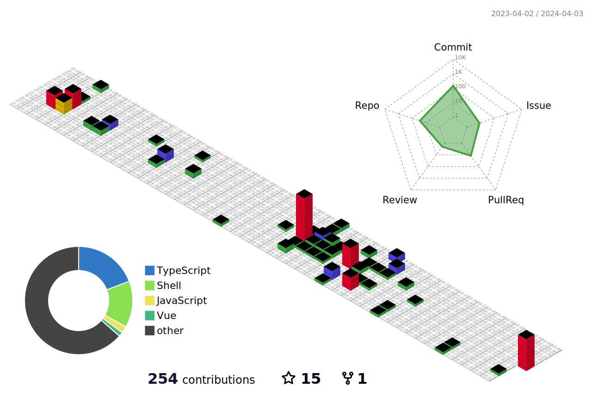

## 👋 This is Koi! 

[](https://akko.netlify.app)

- 🤔 hi,there, i'm a WEB front-end worker, and —— happily builds applications with the familiar front-end technology.
- 😍 TypeScript enthusiast, Node.js user, Rust & Go beginner

<div>
    
    
</div>

<p></p>


</div>


- 💼 any freelance work? do reach, [email](1184563958@qq.com) :)
- 💬 ask me about anything, i am happy to help;

### 🔭 Tech stack


### 🛠 Tools I use


📊 **this week i spent my time on:**
<!--START_SECTION:waka-->

```txt
From: 01 July 2023 - To: 30 June 2024

Total Time: 47 hrs 11 mins

TypeScript        26 hrs 33 mins  ██████████████░░░░░░░░░░░   56.28 %
Markdown          6 hrs 35 mins   ███▒░░░░░░░░░░░░░░░░░░░░░   13.97 %
Vue.js            5 hrs 56 mins   ███░░░░░░░░░░░░░░░░░░░░░░   12.60 %
JSON              2 hrs 44 mins   █▒░░░░░░░░░░░░░░░░░░░░░░░   05.82 %
JavaScript        2 hrs 30 mins   █▒░░░░░░░░░░░░░░░░░░░░░░░   05.31 %
HTML              40 mins         ▒░░░░░░░░░░░░░░░░░░░░░░░░   01.43 %
YAML              32 mins         ▒░░░░░░░░░░░░░░░░░░░░░░░░   01.14 %
Other             23 mins         ▒░░░░░░░░░░░░░░░░░░░░░░░░   00.85 %
TSConfig          18 mins         ▒░░░░░░░░░░░░░░░░░░░░░░░░   00.67 %
XML               17 mins         ░░░░░░░░░░░░░░░░░░░░░░░░░   00.62 %
```

<!--END_SECTION:waka-->



### 📚 Latest Posts
RSS自动生成和生成文章的插件目前有三方兼容问题，待作者修复，可以直接查看readme顶部的小站
<!-- BLOG-POST-LIST:START -->
- [10.柏林噪声生成地图](https://akko.netlify.app/posts/cocos/12.柏林噪声生成地图/index)
- [09.protobuf](https://akko.netlify.app/posts/cocos/11.protobuf/index)
- [08.grpc](https://akko.netlify.app/posts/cocos/10.grpc/index)
- [07.gateway](https://akko.netlify.app/posts/cocos/09.gateway/index)
- [06.uuid生成token](https://akko.netlify.app/posts/cocos/08.uuid生成token/index)
<!-- BLOG-POST-LIST:END -->


