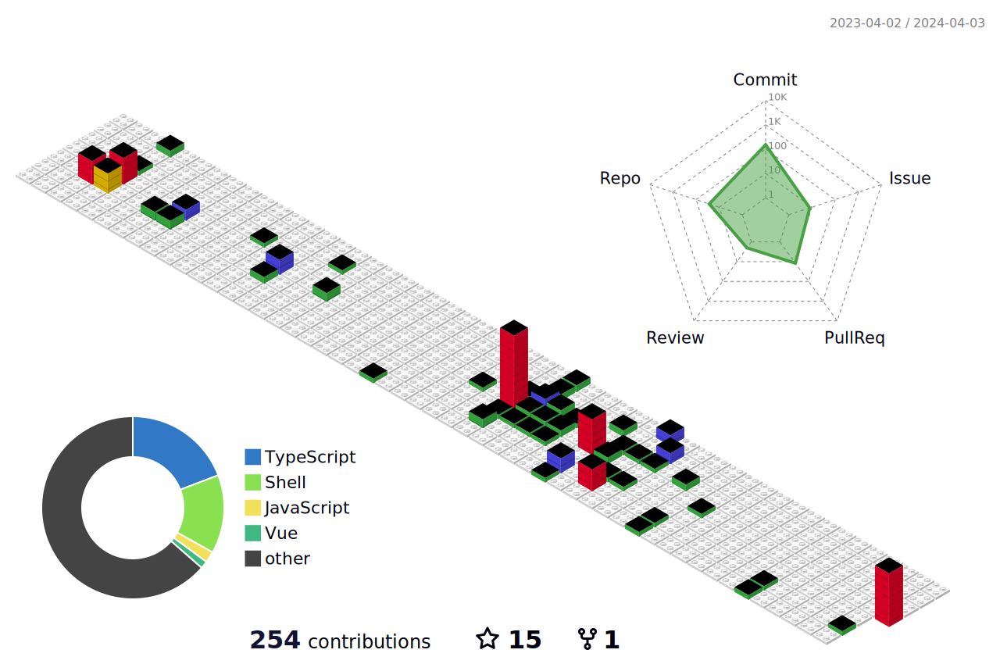

## 👋 This is Koi! 

[](https://akko.netlify.app)

- 🤔 hi,there, i'm a WEB front-end worker, and —— happily builds applications with the familiar front-end technology.
- 😍 TypeScript enthusiast, Node.js user, Rust & Go beginner

<div>
    
    
</div>

<p></p>


</div>


- 💼 any freelance work? do reach, [email](1184563958@qq.com) :)
- 💬 ask me about anything, i am happy to help;

### 🔭 Tech stack


### 🛠 Tools I use


📊 **this week i spent my time on:**
<!--START_SECTION:waka-->

```txt
From: 03 April 2025 - To: 03 April 2026

Total Time: 14 hrs 47 mins

TypeScript                 8 hrs 10 mins         █████████████▓░░░░░░░░░░░   55.23 %
JSON                       2 hrs 7 mins          ███▓░░░░░░░░░░░░░░░░░░░░░   14.34 %
Vue.js                     1 hr 38 mins          ██▓░░░░░░░░░░░░░░░░░░░░░░   11.08 %
Markdown                   34 mins               █░░░░░░░░░░░░░░░░░░░░░░░░   03.87 %
HTML                       18 mins               ▓░░░░░░░░░░░░░░░░░░░░░░░░   02.07 %
YAML                       16 mins               ▒░░░░░░░░░░░░░░░░░░░░░░░░   01.86 %
Other                      15 mins               ▒░░░░░░░░░░░░░░░░░░░░░░░░   01.80 %
Bash                       15 mins               ▒░░░░░░░░░░░░░░░░░░░░░░░░   01.71 %
Go                         12 mins               ▒░░░░░░░░░░░░░░░░░░░░░░░░   01.46 %
TOML                       12 mins               ▒░░░░░░░░░░░░░░░░░░░░░░░░   01.40 %
```

<!--END_SECTION:waka-->



### 📚 Latest Posts
RSS自动生成和生成文章的插件目前有三方兼容问题，待作者修复，可以直接查看readme顶部的小站
<!-- BLOG-POST-LIST:START -->
- [初识sonicpi](https://akko.netlify.app/posts/music/01初识sonicpi)
- [02.乐理](https://akko.netlify.app/posts/music/02乐理)
- [03.hithat](https://akko.netlify.app/posts/music/03hithat)
- [10.柏林噪声生成地图](https://akko.netlify.app/posts/cocos/12.柏林噪声生成地图/index)
- [09.protobuf](https://akko.netlify.app/posts/cocos/11.protobuf/index)
<!-- BLOG-POST-LIST:END -->


