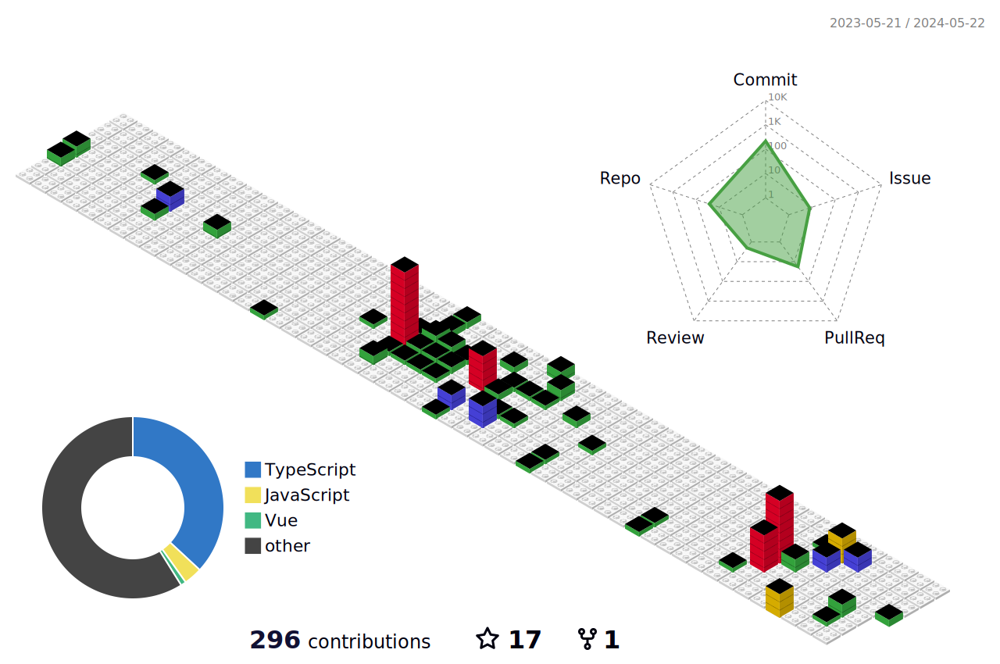

## 👋 This is Koi! 

[](https://akko.netlify.app)

- 🤔 hi,there, i'm a WEB front-end worker, and —— happily builds applications with the familiar front-end technology.
- 😍 TypeScript enthusiast, Node.js user, Rust & Go beginner

<div>
    
    
</div>

<p></p>


</div>


- 💼 any freelance work? do reach, [email](1184563958@qq.com) :)
- 💬 ask me about anything, i am happy to help;

### 🔭 Tech stack


### 🛠 Tools I use


📊 **this week i spent my time on:**
<!--START_SECTION:waka-->

```txt
From: 15 April 2023 - To: 14 April 2024

Total Time: 29 hrs 10 mins

TypeScript        17 hrs 46 mins  ███████████████▒░░░░░░░░░   60.94 %
Vue.js            5 hrs           ████▒░░░░░░░░░░░░░░░░░░░░   17.17 %
JavaScript        1 hr 58 mins    █▓░░░░░░░░░░░░░░░░░░░░░░░   06.77 %
JSON              1 hr 34 mins    █▒░░░░░░░░░░░░░░░░░░░░░░░   05.38 %
Markdown          59 mins         █░░░░░░░░░░░░░░░░░░░░░░░░   03.38 %
HTML              40 mins         ▓░░░░░░░░░░░░░░░░░░░░░░░░   02.31 %
YAML              24 mins         ▒░░░░░░░░░░░░░░░░░░░░░░░░   01.40 %
TSConfig          17 mins         ▒░░░░░░░░░░░░░░░░░░░░░░░░   01.00 %
Other             9 mins          ░░░░░░░░░░░░░░░░░░░░░░░░░   00.54 %
Git Config        6 mins          ░░░░░░░░░░░░░░░░░░░░░░░░░   00.40 %
```

<!--END_SECTION:waka-->



### 📚 Latest Posts
<!-- BLOG-POST-LIST:START -->
- [loadEnv](https://akko.netlify.app/posts/vite/loadEnv)
- [stable diffision](https://akko.netlify.app/posts/stable dffision/01.install)
- [记录一次react面试](https://akko.netlify.app/posts/react/interview)
<!-- BLOG-POST-LIST:END -->

